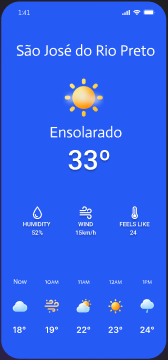

# wheater_app

O WeatherApp é um aplicativo desenvolvido em Flutter que se conecta a uma API de dados meteorológicos em tempo real para fornecer informações precisas sobre o clima. Com uma interface intuitiva, ele oferece previsões climáticas previstas, alertas de condições adversas e uma experiência de usuário ambiental para manter os usuários sempre informados sobre as condições climáticas atuais e futuras.

